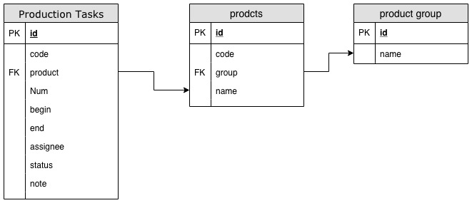

# organization
```sql
    CREATE TABLE organization (
        id MEDIUMINT NOT NULL AUTO_INCREMENT,
        name VARCHAR(255) NOT NULL,
        included_modules TEXT NOT NULL,
        created_at TIMESTAMP NULL DEFAULT CURRENT_TIMESTAMP,
        updated_at TIMESTAMP NULL DEFAULT CURRENT_TIMESTAMP ON UPDATE CURRENT_TIMESTAMP,
        isdeleted MEDIUMINT NOT NULL DEFAULT 0,
        PRIMARY KEY (id),
        UNIQUE KEY name (name, isdeleted)
    ) CHARACTER SET = utf8;
    INSERT INTO organization (name, included_modules) VALUES ('bivrost', '*');
```

# department
```sql
    CREATE TABLE department (
        id MEDIUMINT NOT NULL AUTO_INCREMENT,
        name VARCHAR(255) NOT NULL,
        belong MEDIUMINT NOT NULL DEFAULT 1,
        note TEXT,
        created_at TIMESTAMP NULL DEFAULT CURRENT_TIMESTAMP,
        updated_at TIMESTAMP NULL DEFAULT CURRENT_TIMESTAMP ON UPDATE CURRENT_TIMESTAMP,
        PRIMARY KEY (id),
        UNIQUE KEY (name),
        FOREIGN KEY (belong) REFERENCES department(id)
    ) CHARACTER SET = utf8;
    INSERT INTO department (name, belong, note) VALUES ('bivrost', '1', '彼络科技'), ('R&D', '1', '研发部门');
```

# role
```sql
    CREATE TABLE role (
        id MEDIUMINT NOT NULL AUTO_INCREMENT,
        name VARCHAR(255) NOT NULL,
        note TEXT,
        privilege TEXT,
        created_at TIMESTAMP NULL DEFAULT CURRENT_TIMESTAMP,
        updated_at TIMESTAMP NULL DEFAULT CURRENT_TIMESTAMP ON UPDATE CURRENT_TIMESTAMP,
        PRIMARY KEY (id),
        UNIQUE KEY (name)
    ) CHARACTER SET = utf8;
    INSERT INTO role (name, note, privilege) VALUES ('admin', 'bivrost', 'admin'), ('analysis', 'bivrost', 'analysis'), ('production', 'bivrost', 'production'), ('user', 'bivrost', 'user'), ('monitor', 'bivrost', 'monitor'), ('developer', 'bivrost', 'analysis,production,user,monitor');
```

# user
```sql
    CREATE TABLE user (
        id MEDIUMINT NOT NULL AUTO_INCREMENT,
        email VARCHAR(255) NOT NULL,
        name VARCHAR(255) NOT NULL,
        password VARCHAR(255) NOT NULL,
        organization_id MEDIUMINT NOT NULL,
        nickname VARCHAR(255),
        phone VARCHAR(255),
        gender VARCHAR(255),
        department_id MEDIUMINT,
        created_at TIMESTAMP NULL DEFAULT CURRENT_TIMESTAMP,
        updated_at TIMESTAMP NULL DEFAULT CURRENT_TIMESTAMP ON UPDATE CURRENT_TIMESTAMP,
        isdeleted MEDIUMINT NOT NULL DEFAULT 0,
        PRIMARY KEY (id),
        UNIQUE KEY email (email, isdeleted),
        FOREIGN KEY (organization_id) REFERENCES organization(id), 
        FOREIGN KEY (department_id) REFERENCES department(id) ON DELETE SET NULL
    ) CHARACTER SET = utf8;
    INSERT INTO user (email, name, password, organization_id, phone, gender, department_id) VALUES
    ('test@bivrost.cn', 'Olly', '$2b$10$.u/PC4ZsfbEEyxvB5ANBYuiRlj.wcxdS/yTZQkyoPqS/fDW6Y.8v2', 1, '0755-8888888', 'female', 1),
    ('guest@bivrost.cn', 'guest', '$2b$10$.u/PC4ZsfbEEyxvB5ANBYuiRlj.wcxdS/yTZQkyoPqS/fDW6Y.8v2', 1, '0755-8888888', 'male', 1),
    ('developer@bivrost.cn', 'Luka', '$2b$10$.u/PC4ZsfbEEyxvB5ANBYuiRlj.wcxdS/yTZQkyoPqS/fDW6Y.8v2', 1, '0755-8888888', 'male', 2);
```

# userrole
```sql
    CREATE TABLE userrole (
        id MEDIUMINT NOT NULL AUTO_INCREMENT,
        user_id MEDIUMINT NOT NULL,
        role_id MEDIUMINT NOT NULL,
        created_at TIMESTAMP NULL DEFAULT CURRENT_TIMESTAMP,
        updated_at TIMESTAMP NULL DEFAULT CURRENT_TIMESTAMP ON UPDATE CURRENT_TIMESTAMP,
        PRIMARY KEY (id),
        FOREIGN KEY (user_id) REFERENCES user(id) ON DELETE CASCADE,
        FOREIGN KEY (role_id) REFERENCES role(id) ON DELETE CASCADE
    ) CHARACTER SET = utf8;
    INSERT INTO userrole (user_id, role_id) VALUES (1, 1), (2, 2), (2, 3), (3, 6);
```

# productgroup
```sql
    CREATE TABLE productgroup (
        id MEDIUMINT NOT NULL AUTO_INCREMENT,
        code VARCHAR(255),
        name VARCHAR(255) NOT NULL,
        note TEXT,
        created_at TIMESTAMP NULL DEFAULT CURRENT_TIMESTAMP,
        updated_at TIMESTAMP NULL DEFAULT CURRENT_TIMESTAMP ON UPDATE CURRENT_TIMESTAMP,
        isdeleted MEDIUMINT NOT NULL DEFAULT 0,
        PRIMARY KEY (id),
        UNIQUE KEY name (name, isdeleted)
    ) CHARACTER SET = utf8;
    INSERT INTO productgroup (code, name, note) VALUES ('cam', 'camera', 'bivrost camera');
```

# product
```sql
    CREATE TABLE product (
        id MEDIUMINT NOT NULL AUTO_INCREMENT,
        code VARCHAR(255),
        productgroup_id MEDIUMINT,
        name VARCHAR(255) NOT NULL,
        price INT,
        note TEXT,
        created_at TIMESTAMP NULL DEFAULT CURRENT_TIMESTAMP,
        updated_at TIMESTAMP NULL DEFAULT CURRENT_TIMESTAMP ON UPDATE CURRENT_TIMESTAMP,
        isdeleted MEDIUMINT NOT NULL DEFAULT 0,
        PRIMARY KEY (id),
        UNIQUE KEY name (name, isdeleted),
        FOREIGN KEY (productgroup_id) REFERENCES productgroup(id) ON DELETE SET NULL
    ) CHARACTER SET = utf8;
    INSERT INTO product (code, productgroup_id, name, price, note) 
    VALUES ('1200p-b', 1, 'Black Magic', 10000, '1200万像素黑色相机'), ('2400p-r', 1, 'Red Sea', 30000, '2400万像素红色相机');
```

# productionplan
```sql
    CREATE TABLE productionplan (
        id MEDIUMINT NOT NULL AUTO_INCREMENT,
        title VARCHAR(255) NOT NULL,
        begin DATE NOT NULL,
        end DATE NOT NULL,
        assignee_id MEDIUMINT NOT NULL,
        status VARCHAR(255) NOT NULL,
        product_id MEDIUMINT,
        quantity INT,
        note TEXT,
        created_at TIMESTAMP NULL DEFAULT CURRENT_TIMESTAMP,
        updated_at TIMESTAMP NULL DEFAULT CURRENT_TIMESTAMP ON UPDATE CURRENT_TIMESTAMP,
        isdeleted MEDIUMINT NOT NULL DEFAULT 0,
        PRIMARY KEY (id),
        FOREIGN KEY (product_id) REFERENCES product(id) ON DELETE SET NULL,
        FOREIGN KEY (assignee_id) REFERENCES user(id)
    ) CHARACTER SET = utf8;
    INSERT INTO productionplan (title, begin, end, assignee_id, status, product_id, quantity, note)
    VALUES ('Apple Order', '2019-01-01', '2019-01-31', 3, 'complete', 1, 1000000, '请使用1号生产线'), ('Apple Order', '2019-03-01', '2019-03-31', 3, 'waiting', 1, 1000000, "重要订单，优先安排"), ('Dell Order', '2019-04-01', '2019-04-15', 1, 'waiting', 2, 500000, "重要订单，优先安排");
```

# chartdata
```sql
    CREATE TABLE chartdata (
        id MEDIUMINT NOT NULL AUTO_INCREMENT,
        user_id MEDIUMINT NOT NULL,
        data TEXT NOT NULL,
        key_name VARCHAR(50) NOT NULL,
        name VARCHAR(50) NOT NULL,
        created_at TIMESTAMP NULL DEFAULT CURRENT_TIMESTAMP,
        updated_at TIMESTAMP NULL DEFAULT CURRENT_TIMESTAMP ON UPDATE CURRENT_TIMESTAMP,
        PRIMARY KEY (id), 
        FOREIGN KEY (user_id) REFERENCES user(id) 
    ) CHARACTER SET = utf8;
```

# grant permission
```sql
    GRANT ALL PRIVILEGES ON bivcloud_beta.* TO 'developer'@'%' IDENTIFIED BY 'password';
    FLUSH PRIVILEGES;
```