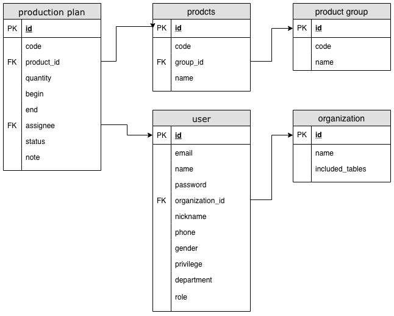

# productionstatus
```sql
    CREATE TABLE productionstatus (
        id SMALLINT NOT NULL AUTO_INCREMENT,
        status VARCHAR(255) NOT NULL,
        PRIMARY KEY (id),
        UNIQUE KEY (status)
    ) CHARACTER SET = utf8;
    INSERT INTO productionstatus (id, status) VALUES (null, 'waiting'), (null, 'working'), (null, 'complete'), (null, 'delayed');
```

# productgroup
```sql
    CREATE TABLE productgroup (
        id MEDIUMINT NOT NULL AUTO_INCREMENT,
        code VARCHAR(255),
        name VARCHAR(255) NOT NULL,
        created_at TIMESTAMP NULL DEFAULT CURRENT_TIMESTAMP,
        updated_at TIMESTAMP NULL DEFAULT CURRENT_TIMESTAMP ON UPDATE CURRENT_TIMESTAMP,
        PRIMARY KEY (id),
        UNIQUE KEY (name)
    ) CHARACTER SET = utf8;
```

# product
```sql
    CREATE TABLE product (
        id MEDIUMINT NOT NULL AUTO_INCREMENT,
        code VARCHAR(255),
        productgroup_id MEDIUMINT,
        name VARCHAR(255) NOT NULL,
        created_at TIMESTAMP NULL DEFAULT CURRENT_TIMESTAMP,
        updated_at TIMESTAMP NULL DEFAULT CURRENT_TIMESTAMP ON UPDATE CURRENT_TIMESTAMP,
        PRIMARY KEY (id),
        UNIQUE KEY (code),
        UNIQUE KEY (name),
        FOREIGN KEY (productgroup_id) REFERENCES productgroup(id)
    ) CHARACTER SET = utf8;
```

# productionplan
```sql
    CREATE TABLE productionplan (
        id MEDIUMINT NOT NULL AUTO_INCREMENT,
        code VARCHAR(255),
        product_id MEDIUMINT NOT NULL,
        quantity INT NOT NULL,
        begin DATE NOT NULL,
        end DATE NOT NULL,
        assignee VARCHAR(32) NOT NULL,
        status_id SMALLINT NOT NULL,
        note TEXT,
        created_at TIMESTAMP NULL DEFAULT CURRENT_TIMESTAMP,
        updated_at TIMESTAMP NULL DEFAULT CURRENT_TIMESTAMP ON UPDATE CURRENT_TIMESTAMP,
        PRIMARY KEY (id),
        UNIQUE KEY(code),
        FOREIGN KEY (product_id) REFERENCES product(id),
        FOREIGN KEY (status_id) REFERENCES productionstatus(id)
    ) CHARACTER SET = utf8;
```